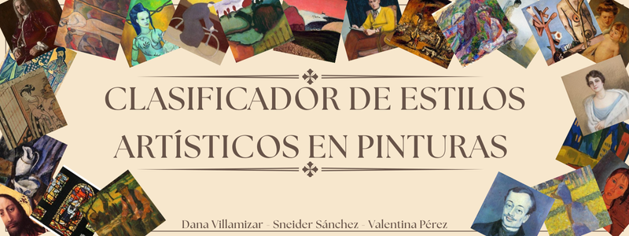

  <h1 align="center">Clasificador de estilos artisticos</h1>
  

  

    
  

  

    <a href="https://github.com/DanaVillamizar" rel="external nofollow noopener" target="_blank"><strong>Dana Meliza Villamizar</strong></a>
    .
    <a href="https://github.com/Sneider-exe" rel="external nofollow noopener" target="_blank"><strong>Brayan Sneider Sánchez</strong></a>
    ·
    <a href="https://github.com/valperz" rel="external nofollow noopener" target="_blank"><strong>Valentina Pérez</strong></a>
  

    Proyecto de Inteligencia Artificial II– UIS 2025-2

---

## Motivación

Este proyecto busca aplicar deep learning en la clasificación de estilos artísticos, combinando un reto técnico con la oportunidad de acercar el arte a la inteligencia artificial

---

## Objetivo

Clasificar pinturas según su estilo artístico empleando técnicas de deep learning aplicadas a imágenes del dataset ArtBench

---

## Dataset

[Descargar dataset](https://huggingface.co/datasets/zguo0525/ArtBench)

--- 

## Modelos

### Modelos base
-DNN

-CNN a mano

-CNN con transfer learning (Densenet121 & InceptionV3)

### Autoencoder
-Autoencoder entrenado para hacer reconstrucción

-Encoder + MLP para clasificación

---

## Enlaces Útiles

- [Diapositivas](https://www.canva.com/design/DAGzEcd7_Xs/oQPN5e3EXQixM1OW4Uh4Yg/edit?utm_content=DAGzEcd7_Xs&utm_campaign=designshare&utm_medium=link2&utm_source=sharebutton)
- [Video explicativo](https://youtu.be/gSD1yYf296Q)
